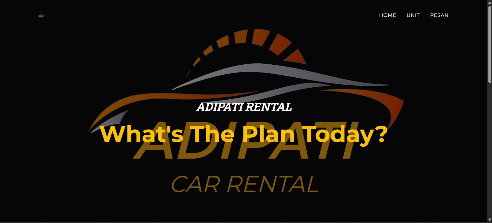
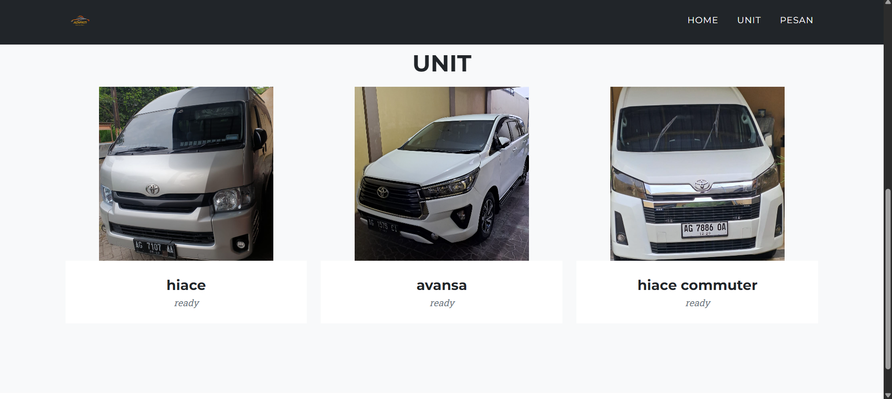
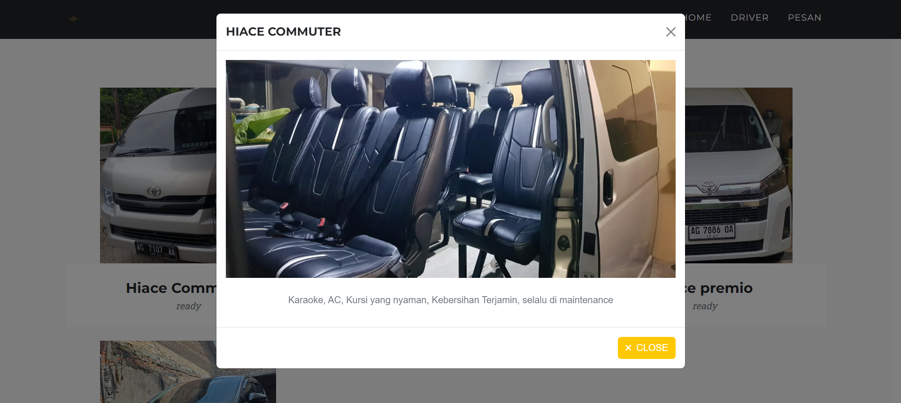
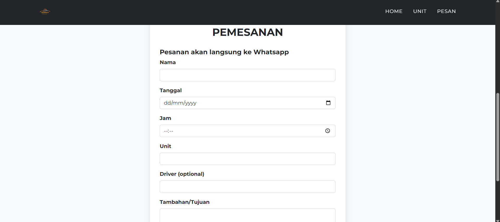
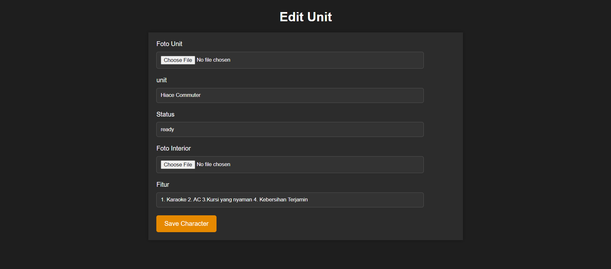
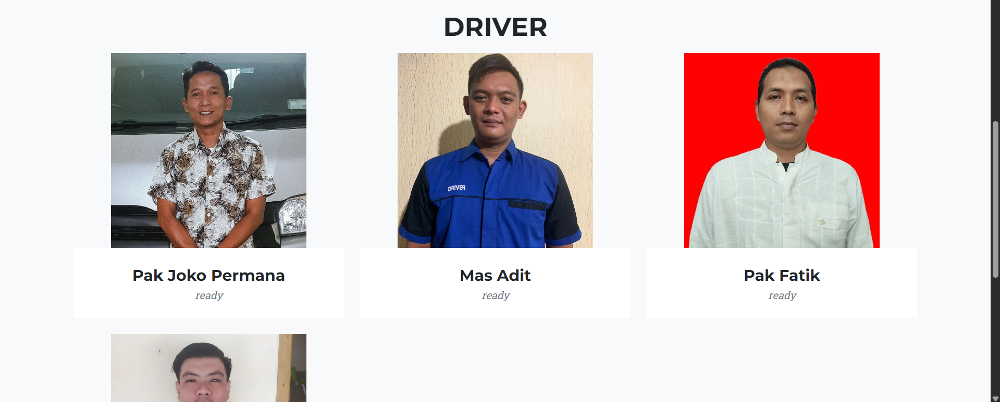
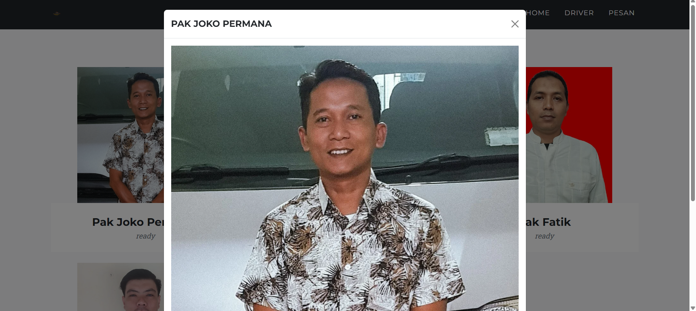
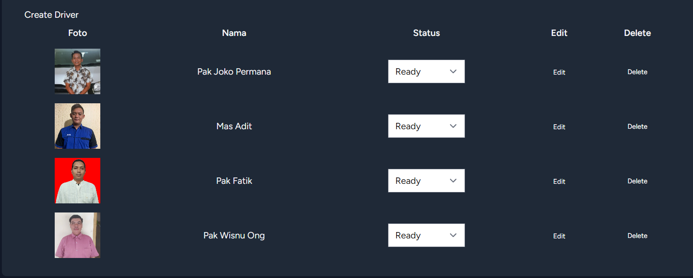
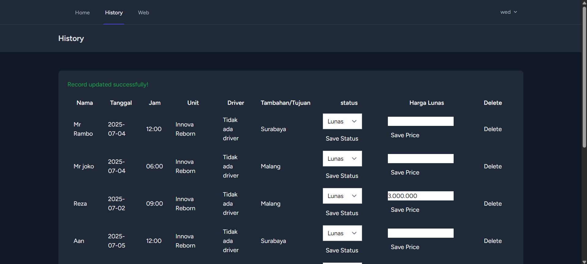
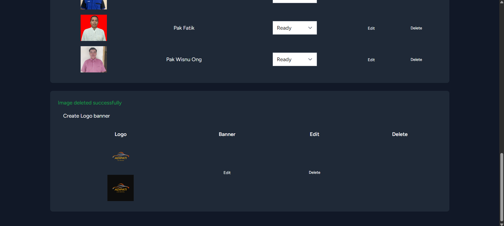

\

\
\</p\>

\

\<strong\>🚗 Online Car Rental & Driver Services System 🚗\</strong\> 
Adipati Rental - Kediri City
\</p\>

-----

## 🌟 About Adipati Rental

**Adipati Rental** is a web-based car rental and driver service system designed to make it easier for customers to book vehicles and professional drivers online in **Kediri City**. 📍

This system solves the headaches of manual booking via traditional phone calls and WhatsApp by providing:

  * **Real-time Access:** Check the availability of cars and drivers instantly. ⏱️
  * **Streamlined Booking:** Online forms that bridge directly to WhatsApp for seamless price negotiation. 📱
  * **Centralized Admin Dashboard:** A complete control center to manage vehicle status, drivers, branding (logos/banners), and order history. 🛠️

The owner (Admin) has full control from a single interface: toggle car/driver availability (**Ready / Unavailable**), perform data management (CRUD), and track order history efficiently.

-----

## ✨ Key Features

### 👤 For Customers (Public)

  * **Real-time Availability:** Browse current lists of cars and drivers.
  * **Detailed Views:** Check out car interiors and specific amenities. 📸
  * **Status Indicators:** Instantly see if a driver is **Ready** or **Unavailable**.
  * **WhatsApp Integration:** Automated redirection from the booking form to chat.
  * **Hassle-Free:** Place orders without needing to create an account. 🔓

### 🛡️ For Admin (Dashboard)

  * **Vehicle Management:** Full CRUD (Create, Read, Update, Delete) for the car fleet.
  * **Driver Management:** Manage driver profiles and toggle their availability.
  * **Customization:** Easily update the website's logo and promotional banners. 🖼️
  * **Order Tracking:** View a comprehensive history of all bookings.
  * **Payment Updates:** Finalize pricing and update order statuses (**Paid / Canceled**). 💰

-----

## 💻 Tech Stack

  * **Framework:** Laravel (PHP) 🐘
  * **Frontend:** Bootstrap, HTML, CSS, JavaScript 🎨
  * **Database:** MySQL 🗄️
  * **Local Server:** XAMPP 🚀
  * **Integration:** WhatsApp API (Auto-redirect)
  * **Development Method:** Waterfall Model 🌊

-----

## 📸 Screenshots

### Home Page

### Car List

### Car Details

### Registration Page

### Edit Page

### Driver List

### Driver Details

### Admin Dashboard (Drivers)

### Admin Dashboard (Order History)

### Admin Dashboard (Logo & Banner)

-----

## 🛠️ How to Use

1.  Visit the website → `/adipati_rental/pendaftaran` 🌐
2.  Choose an available car and driver. 🚘
3.  Fill out the booking form. 📝
4.  Click **Place Order** → WhatsApp will open automatically to finalize the deal\!

*Note: Admins can access the dashboard after logging in to manage all data and statuses.*

-----

## 📜 License

This project was developed as a Final Project for the **D-III Information Technology Vocational Program at Universitas Brawijaya**. 🎓  
Copyright © 2025 Adipati Rental Kediri City.

-----

> [\!NOTE]
> **Project Status:** This repository contains the pre-hosting version of the website. The live version includes several improvements and fixes. Please excuse any minor bugs found in this initial release\! 🚧🔧